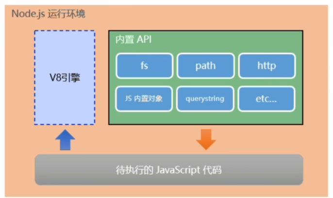

# 初识Node.js

## Node.js是什么

Node.js® is a JavaScript runtime built on Chrome's V8 JavaScript engine

Node.js® 是一个基于 Chrome V8 引擎 的 JavaScript 运行时环境



注意：

1. 浏览器是JavaScript的前端运行环境。
2. Node.js 是JavaScript 的后端运行环境。
3. Node.js 中无法调用DOM和BOM等浏览器内置APl。

## Node.js什么用

* 基于 [Express 框架](https://www.expressjs.com.cn/) (opens new window)，可以快速构建 Web 应用
* 基于 [Electron 框架](https://www.electronjs.org/) (opens new window)，可以构建跨平台的桌面应用
* 基于 [restify 框架](http://restify.com/) (opens new window)，可以快速构建 API 接口项目
* 读写和操作数据库、创建实用的命令行工具辅助前端开发、etc…

## Node.js怎么学

JavaScript 基础语法＋Node.js 内置API模块(（fs、path、http等)＋第三方API模块(express、mysql等)

## Node.js安装

安装包可以从Node.js 的官网首页直接下载，进入到[Node.js 的官网首页](https://nodejs.org/en/)，点击绿色的按钮，下载所需的版本后，双击直接安装即可。

### 终端介绍

终端(英文: Terminal)是专门为开发人员设计的，用于实现人机交互的一种方式。
作为一名合格的程序员，我们有必要识记一些常用的终端命令，来辅助我们更好的操作与使用计算机。

常见终端命令

```c
// 查看Node版本
node -v
//切换路径
cd 路径
//执行js代码
node 要执行的js文件的路径
//使用↑键，可以快速定位到上一次执行的命令
//使用tab键，能够快速补全路径
//使用esc键，能够快速清空当前已输入的命令
//清空当前终端
cls
```
